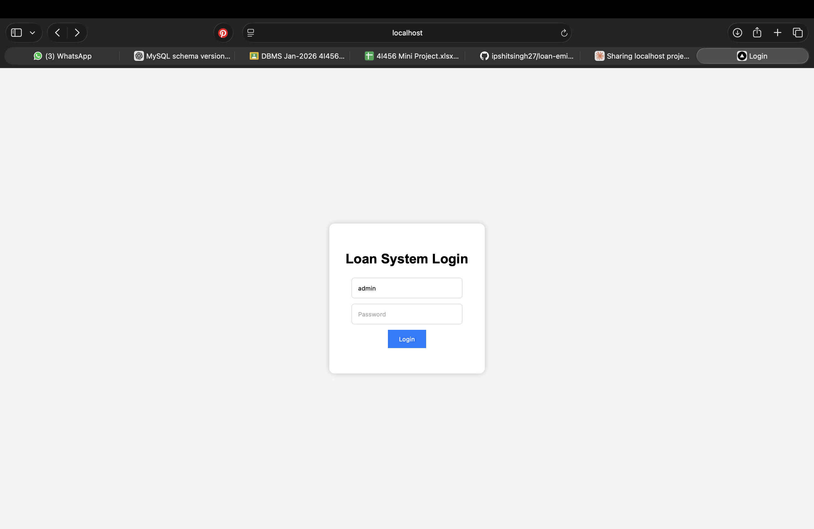
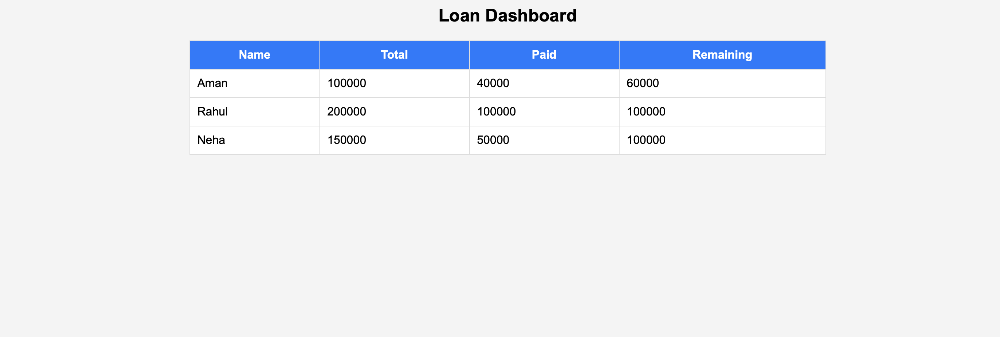

# 🏦 Loan Management System

A simple yet functional web-based Loan Management System built as a mini project. The system allows authorized users to securely log in and view a complete dashboard of all active loans, including details like customer name, total loan amount, amount paid, and remaining balance.

This project was built using **Node.js** and **Express.js** on the backend, with **MySQL** as the database to store user credentials and loan records. The frontend is served directly through Express using plain HTML and CSS — no separate framework needed.

---

## 📸 Screenshots

### Login Page

### Dashboard

---

## 🚀 Features

- 🔐 Secure login system with username and password authentication
- 📊 Dashboard that displays all loan records from the database
- 🗄️ MySQL database integration for storing users and loan data
- 🌐 REST API built with Express.js to handle login and data fetching
- 💡 Clean and minimal UI with centered layout and responsive design

---

## 🛠️ Tech Stack

| Technology | Usage |
|------------|-------|
| Node.js | Backend runtime environment |
| Express.js | Web framework for routing and API |
| MySQL | Relational database for storing data |
| HTML & CSS | Frontend structure and styling |
| JavaScript | Core programming language |

---

## ⚙️ Installation & Setup

Follow these steps to run the project locally on your machine:

**1. Clone the repository**
\`\`\`bash
git clone https://github.com/ipshitsingh27/loan-management-system.git
cd loan-management-system
\`\`\`

**2. Install dependencies**
\`\`\`bash
npm install
\`\`\`

**3. Setup MySQL Database**

Create a database called `loan_system` and add the required tables for `users` and `loans`.

**4. Run the server**
\`\`\`bash
node server.js
\`\`\`

**5. Open in browser**
\`\`\`
http://localhost:3000
\`\`\`

---

## 📁 Project Structure

\`\`\`
loan-management-system/
├── screenshots/
│   ├── login.png
│   └── dashboard.png
├── server.js
├── package.json
├── package-lock.json
└── .gitignore
\`\`\`

---

## 👨‍💻 Author

**Ipshit Singh**
GitHub: [@ipshitsingh27](https://github.com/ipshitsingh27)

---

## 📄 License

This project is open source and available under the [MIT License](LICENSE).
